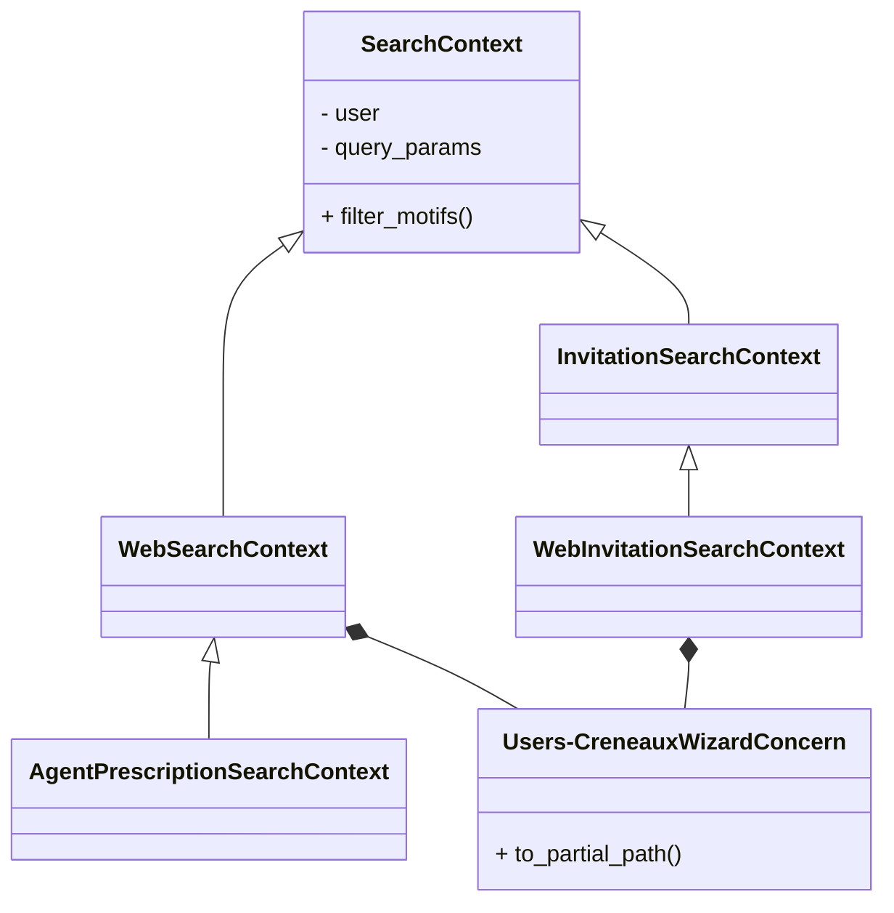

# Tech Tips

Quelques notes à propos de commandes, de scripts et autres bricoles qui nous aident.

## Console SuperAdmin

L’accès à /super_admins se fait:
* en `production` et en `development`, en OAuth via un compte GitHub
    * en `development`, le premier compte à tenter d’accéder est automatiquement ajouté.
* sur les review apps, en http Basic.
    * login: rdv-solidarites
    * password: défini automatiquement au déploiement (cf [scalingo.json](scalingo.json))
    * obtenu avec `scripts/review_app_super_admin_password.sh <numéro de la PR>`

## Schéma de données de la base

Il est possible de générer un diagramme de la base Postgres avec la commande :

```shell
make generate_db_diagram
```

Cela (re-)génère le fichier docs/domain_model.svg à partir de la base et des déclarations d'associations Rails.

Note : la librairie graphviz doit être installée ([voir guide](https://voormedia.github.io/rails-erd/install.html)).

## Tâches récurrentes

Nous utilisons la fonctionnalité de cron inclue dans GoodJob pour gérer nos tâches récurrentes.
Les jobs récurrents sont implémentés dans `app/jobs/cron_job.rb`.
Les horaires de ces jobs sont définis dans `config/initializers/good_job.rb`.

## Dumps de production

### Règles d'utilisation

Pour du débuggage ou des investigations sur la performance, il peut arriver aux membres de l'équipe de télécharger un dump de la production.

Cette opération est sensible, et doit donc toujours se faire en suivant ces règles :
- Supprimez le fichier zip du dump dès qu'il est chargé localement. Vérifiez qu'il est bien supprimé de la corbeille
- dès que vous avez fini votre investigation, supprimez la base de données et reprenez le seed avec les données factices.
- Pour éviter un oubli, ne gardez jamais un dump de production chargé en local pour plus de 48h.
- Faites attention à ce qu'il n'y ai pas de backup automatique de votre disque dur pendant que le dump de la db est dessus, que ça soit sous la forme de données en base, de fichier .pgsql, ou de fichier dans la corbeille.

Pour tester les migrations avec les données de prod, il faut récupérer un backup de la prod localement. Ça permet aussi de tester que nous arrivons bien à récupérer un backup valable de la production.

- `tar -xvzf <fichier-backup.tgz>` pour obtenir le fichier `.psql` ;
- `bundle exec rails db:drop db:create` ;
- `pg_restore -d development <fichier.pgsql>` ;

Il est recommandé de lancer le serveur local sans le worker sinon il y aura beaucoup de jobs de reminders et de simulations d'envois de mails :

`foreman start -f Procfile.dev  web=1,js=1`

## Export Excel sectorisation

> J’ai créé le secteur « Adour BAB Anglet rues » : vous serait-il possible de me faire une extraction excel de ce secteur uniquement svp ?

> Pour info la marche a suivre pour cet export :

```ruby
ruby scripts/scalingo_dump.rb -e production
rails runner scripts/export_sectors.rb 64
```

> Et la j’ai filtré a la main les lignes demandées.

## Liens utiles

- http://localhost:3000/letter_opener
- http://localhost:3000/rails/mailers
- http://localhost:3000/lapin/sms_preview
- http://localhost:3000/rails/info/routes
- http://localhost:3000/rails/info/properties


#### Tester une WebHook

- copier l’url que te donne `webhook.site` ;
- créer un endpoints, dans la page super admin > webhook, avec cette URL et n'importe quel secret ;
- déclencher des évènements en faisant des actions depuis l'interface _admin_ pour l'organisation associé ;
- les events apparaissent sur ta page webhook.site laissé ouverte.

## Chargement des absences

Pour le 92, nous chargeons les absences à partir d'un fichier CSV. Ce n'est pas intégré à l'application directement parce que ce n'est peut-être pas la finalité de l'application (?). Nous pourrions rediscuter de tout ça.

En attendant, voici comment procéder.
- avoir le fichier CSV quelque part (pour le format, regarder comme le script fonctionne)
- démarrer un serveur local (j'utilise `http-server`, mais un autre conviens aussi) ex: `http-server -p 9998`
- démarrer [NGROK](https://ngrok.com/) pour faire un tunnel. Brancher Ngrok sur le serveur local. ex: `ngrok http 9998`
- NGROK propose une interface web où nous pouvons trouver la liste des fichiers servi. Copier l'url du fichier à charger
- lancer le script sur scalingo en lui passant l'ID de l'organisation où charger les absences et l'URL du fichier. ex: `scalingo --app monApp run rails r scripts/load_absences_csv.rb 285 http://97b6-92-167-177-12.ngrok.io/mon_fichier`

## Tester les invitations

Pour le moment, il y a un système d'invitation avancé qui est utilisé par RDV-Insertion et qui n'est pas encore intégré dans RDV-Solidarités. Pour tester le cheminement coté RDV-Solidarités, voici comment faire :

- créer un rdv pour un nouvel utilisateur créé à la volée,
- inviter cet utilisateur
- récupérer le token dans le mail d‘invitation de letter_opener
- aller sur l’url du rdv en rajoutant le token en paramètre, ça donne quelque chose comme http://localhost:5000/users/rdvs/1234?invitation_token=MON_TOKEN

## Montée en version des dépendances

### Version de Ruby
Pas de politique très clairement décidée mais la pratique est d’essayer de coller à la version la plus récente. Lors de la mise à jour de Ruby, il faut penser à mettre à jour la version cible de la gem `parser` dans le `Gemfile`, cf [le README de parser](https://github.com/whitequark/parser#compatibility-with-ruby-mri).

### Version de Rails
Pas de politique très clairement décidée mais la pratique est d’essayer de coller à la version la plus récente.

### Versions des gems et des node modules

Une politique de mise à jour prudente a été décidée
cf [l’ADR 2023-04-24](https://github.com/betagouv/rdv-service-public/blob/production/docs/decisions/2023-04-24-politique-maj-gems.md)

### Version du DSFR

1. Mettez à jour la version souhaitée du DSFR dans le `package.json`, par exemple `"@gouvfr/dsfr": "^1.9.2"`.
2. Lancez `yarn install`
3. Mettez à jour le lien symbolique vers les fichiers
   précompilés : `ln -s ../node_modules/@gouvfr/dsfr/dist/ public/dsfr-v1.9.2`
4. Dans `app/views/layouts/application_base.html.slim` remplacez les chemins faisant référence au DSFR avec
   la nouvelle version par exemple : `= stylesheet_link_tag "/dsfr-v1.9.2/dsfr.min.css"`

Cette manière de faire permet d’éviter de passer par des compilations d’assets inutiles via webpacker ou sprockets.
Le numéro de version dans les chemins permet de vider les caches des navigateurs lorsque la version du DSFR change.

## Review apps

Les review apps ne sont pas créées automatiquement pour chaque PR pour économiser des ressources.

La commande pour créer une review app pour la PR #4242 est

```bash
scalingo --region osc-secnum-fr1 --app demo-rdv-solidarites integration-link-manual-review-app 4242
```

Un raccourci existe pour retrouver le numéro de la PR correspondant à la branche courante automatiquement : `make review_app`

Par défaut, seul un worker web est activé, si vous souhaitez que les jobs s’exécutent il faut activer un worker jobs depuis le dashboard ou avec cette commande :

```sh
scalingo --region osc-secnum-fr1 --app demo-rdv-solidarites-pr4242 scale jobs:1
```

Le fichier `scalingo.json` décrit la configuration initiale et les variables d’environnement des review apps.
Les review apps sont détruites automatiquement à la fermeture de la PR ou après 48h sans déploiement.
On ne peut pas empêcher une PR spécifique d’être automatiquement détruite après ces 48h.
En revanche, on peut en recréer une nouvelle sans problème.

L’envoi d’email est désactivé par défaut sur les review apps.
Pour l’activer vous pouvez utiliser cette commande :

```sh
    scalingo --region osc-secnum-fr1 --app demo-rdv-solidarites-pr4242 env-unset DISABLE_SENDING_EMAILS && \
    scalingo --region osc-secnum-fr1 --app demo-rdv-solidarites-pr4242 restart
```

## Search Contexts



## Metabase

Nous utilisons Metabase pour donner à l'ensemble de l'équipe une visibilité sur nos données.

Notre dossier d'architecture technique fournit une description haut niveau de notre usage de Metabase :
[architecture-technique.md](architecture-technique.md)

Le script [scripts/etl.sh](scripts/etl.sh) permet de lancer la procédure de copie du dernier backup de la prod vers la base de donnée de l'app `rdv-service-public-etl`.

### Mettre à jour Metabase

Nous avons utilisé le déploiement en un clic décrit dans cette doc de Scalingo :
https://doc.scalingo.com/platform/getting-started/getting-started-with-metabase

Pour mettre à jour Metabase il faut déclencher un deploy en utilisant la commande ci-dessous. 

⚠️ Attention, une mise à jour de Metabase peut mal se passer et rendre notre Metabase indisponible.

```bash
scalingo --app rdv-service-public-metabase deploy https://github.com/Scalingo/metabase-scalingo/archive/refs/heads/master.tar.gz
```
