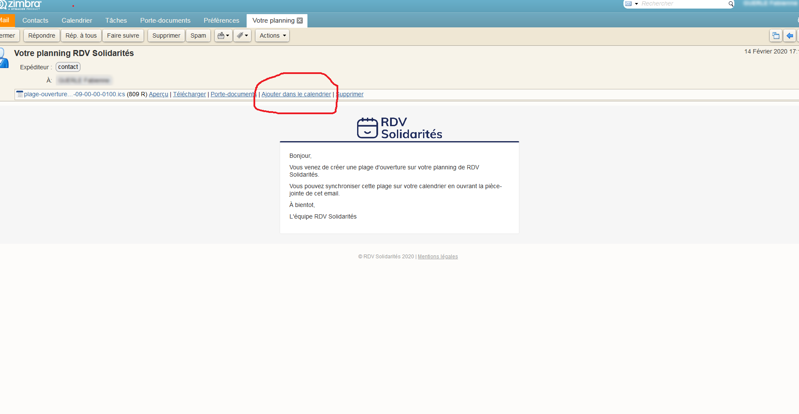
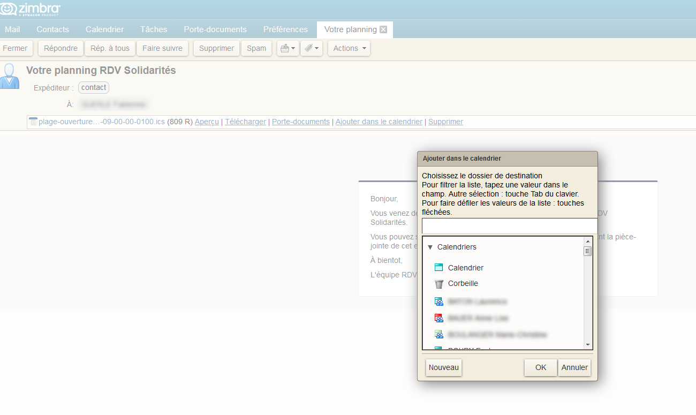
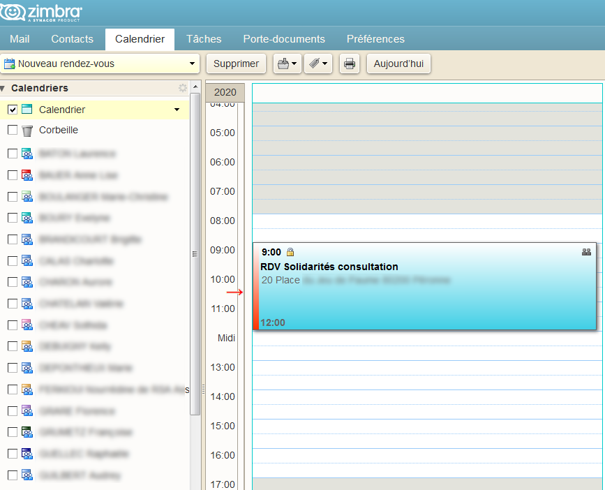

# API de notifications (webhooks)

RDV-Solidarités peut notifier votre système d’information à l’aide de webhooks ou en envoyant des ics par email.

RDV-Solidarités peut notifier n'importe quel système d'information accessible en ligne lors de **modifications** (création, modification, suppression) sur les **RDV**, les **plages d'ouvertures**, les **absences** et les **usagers**.

Pour cela, ce système d'informations doit :
- être accessible à une URL publique par exemple [https://interconnexions.votre-departement.fr/rdv-solidarites](https://interconnexions.votre-departement.fr/rdv-solidarites)
​- accepter des requêtes HTTP POST à cette URL.

Du code d’exemple est [disponible C# et en NodeJS](https://github.com/guillett/webhook).

## Démonstration

Dans notre environnement de démonstration, nous pouvons envoyer des notifications sur une URL de test ou envoyer des emails qui contiennent le contenu brut des notifications envoyées par les requêtes HTTP. Pour cela, [contactez-nous](mailto:contact@rdv-solidarites.fr) !

## Signatures des requêtes

Un secret partagé est associé à chacune de ces URLs pour vous permettre de vérifier que nous sommes bien à l'origine de l'envoi d'information. La requête envoyée en HTTP POST contient un entête `X-Lapin-Signature` qui contient une signature SHA256 hexadécimale du corps de la requête. 

Voilà quelques exemples et informations très pratiques pour valider la signature des corps de requêtes envoyées par RDV-Solidarités.

### En Ruby

```ruby
require 'openssl'
secret = "secret"
data = "content"
mac = OpenSSL::HMAC.hexdige
```

### En Python

```python
import hashlib
import hmac
import sys

def main():
  content = sys.argv[len(sys.argv)-1]
  h = hmac.new(str.encode('secret'), digestmod='sha256')

  print(content)
  h.update(str.encode(content))
  print(h.hexdigest())

if __name__ == '__main__':
  main()
```

### En NodeJS

```js
const crypto = require('crypto')
const prefixIndex = process.argv.indexOf('--content') if (prefixIndex == -1 || process.argv.length <= prefixIndex + 1) { console.log('--content [content] are mandatory') process.exit(1) }
const hmac = crypto.createHmac('sha256', process.env.SHARED_SECRET) const content = process.argv[prefixIndex+1]
console.log(content)
hmac.update(content) console.log(hmac.digest('hex'))
```

### En C#

```c#
using System;
using System.Collections.Generic;
using System.Linq;
using System.Text;
using System.Security.Cryptography;
using System.IO;
using System.Runtime.Remoting.Metadata.W3cXsd2001;

namespace SignatureValidation
{
    class Program
    {
        // Pour l'utilisation de SoapHexBinary
        // cf.
        // https://stackoverflow.com/questions/311165/how-do-you-convert-a-byte-array-to-a-hexadecimal-string-and-vice-versa/2556329#2556329
        static void Main(string[] args)
        {
            int keyPrefix = Array.IndexOf(args, "--key");
            int contentPrefix = Array.IndexOf(args, "--content");
            int signaturePrefix = Array.IndexOf(args, "--signature");

            string key = args[keyPrefix+1];
            string content = args[contentPrefix+1];

            byte[] keyBytes = Encoding.UTF8.GetBytes(key);
            HMACSHA256 hash = new HMACSHA256(keyBytes);

            byte[] byteArray = Encoding.UTF8.GetBytes(content);
            MemoryStream stream = new MemoryStream(byteArray);

            byte[] signature = hash.ComputeHash(stream);

            SoapHexBinary shb = new SoapHexBinary(signature);
            string hexaRepresentation = shb.ToString();
            System.Console.WriteLine(hexaRepresentation);

            if (signaturePrefix>= 0) {
                string providedSignature = args[signaturePrefix+1];
                byte[] providedSignatureBytes = SoapHexBinary.Parse(providedSignature).Value;

                System.Console.WriteLine(providedSignatureBytes.SequenceEqual(signature));
            }

            return;
        }
    }
}
```

## Format des données

Les RDV, les plages d’ouvertures, les absences et les usagers sont envoyés en json, une requête par évènement de création, modification ou suppression.

Le format des données est détaillé dans [la documentation de l'API](https://www.rdv-solidarites.fr/api-docs/).

## Tests

Il est possible de reproduire un appel fait par RDV-Solidarités vers un SI tiers (ici `http://127.0.0.1:3000`) en mettant le texte donné en exemple ci-dessus dans un fichier XXXX.json et d'utiliser la commande suivante :

```sh
curl 'http://127.0.0.1:3000' --data @XXXX.json -H 'Content-Type: application/json; charset=utf-8'
```

## Interconnexion par email et icalendar

En plus des webhooks, RDV-Solidarités peut envoyer des emails aux agents après qu’un rendez-vous a été posé ou modifié, ou lorsqu’une plage d’ouverture est créée ou modifiée. De la même façon, un email est envoyé aux usagers concernés par un rendez-vous.

Ces emails contiennent les informations de l’_évènement_, c’est-à-dire le rendez-vous, la plage d’ouverture ou l’absence, au format icalendar. Elles sont incluses dans le mail en double: une fois en pièce jointe sous forme d’un fichier .ics, une fois en part `text/calendar`. Ce sont les mêmes informations, dupliquées : le but est d’assurer une meilleure compatibilité avec les différents logiciels de calendrier. N’hésitez pas à nous contacter si quelque chose ne fonctionne pas parfaitement chez vous.

En images, le comportement sur Zimbra de l’ajout manuel d’une plage d’ouverture créée dans RDV-Solidarités :







## Outlook

Le département du Pas de Calais a implémenté une solution pour intégrer dans les agendas Outlook des agents, les RDV, les plages d'ouvertures et les absences.

Une partie du ccode source a été [publiée sur GitHub](https://github.com/rdv-solidarites/Rdvs).

## Microsoft Dynamics

Le département des Hauts-de-Seine travaille avec MAZAO et Microsoft pour automatiser l'ajout des RDV et des plages d'ouverture dans Microsoft Dynamics.

## FAQ

### Est-ce que RDV-Solidarités envoie des requêtes PUT et ou DELETE pour la modification et la suppression de ressources (RDV, Absences, Plages d'ouvertures, etc) ?

Non, les notifications par webhooks ne sont pas prévues pour modifier des éléments dans votre SI mais pour signaler des modifications dans la base de données de RDV-Solidarités qui devraient être répercutées dans votre SI.

### Est-ce que RDV-Solidarités traite les erreurs ? Par exemple, l’email, le nom et le prénom que vous nous fournissez n’existe pas chez nous, une erreur dans une date, l’adresse n’existe pas…

Non, pas pour le moment. Cela serait prématuré. Vous pouvez enregistrer un log de votre côté et nous contacter quand cela arrivera. Nous verrons à ce moment-là si des développements supplémentaires sont nécessaires.


