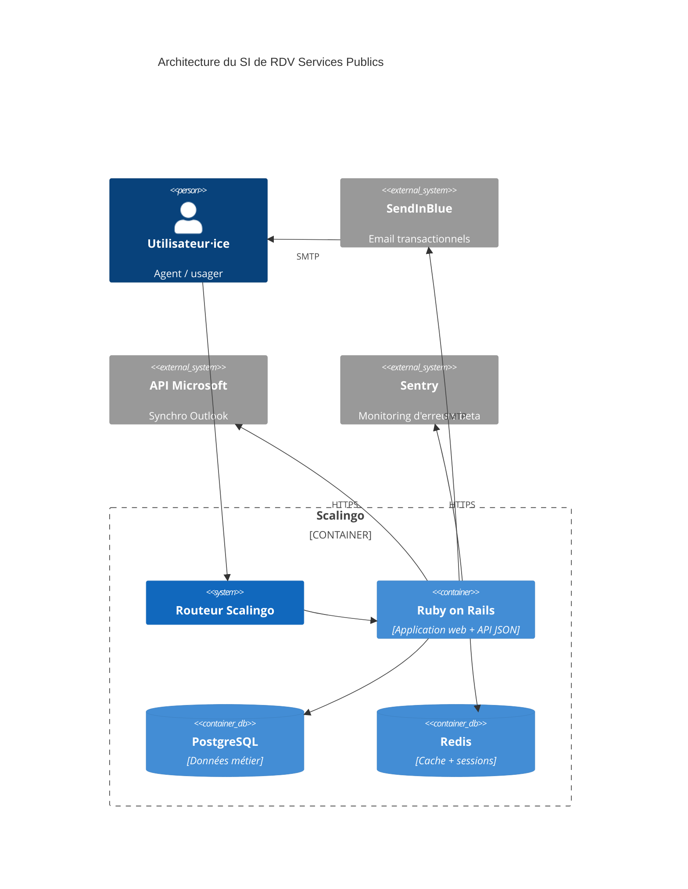

# Dossier technique

__IMPORTANT: DOSSIER A COMPLETER EN ÉDITANT TOUTES LES PARTIES `!!<>!!`__

> Ce dossier a pour but de présenter l’architecture technique du SI. Il n’est par conséquent ni un dossier d’installation, ni un dossier d’exploitation ou un dossier de spécifications fonctionnelles.

**Nom du projet :** RDV Services Publics

**Dépôt de code :** https://github.com/betagouv/rdv-solidarites.fr

**Hébergeur :** Scalingo, Paris (région Scalingo "osc-secnum-fr1", région Outscale "cloudgouv-eu-west-1")

**Décision d’homologation :** !!<date>!!

**France Relance :**  !!<✅/❌>!!

**Inclusion numérique :** ✅

## Suivi du document

> Le suivi de ce document est assure par le versionnage Git.

## Fiche de contrôle

> Cette fiche a pour vocation de lister l’ensemble des acteurs du projet ainsi que leur rôle dans la rédaction de ce dossier.

| Organisme                  | Nom                   | Rôle                    | Activité            |
|----------------------------|-----------------------|-------------------------|---------------------|
| RDV Services Publics       | François Ferrandis    | Lead tech               | Rédaction           |
| RDV Services Publics       | Victor Mours          | Lead tech               | Relecture           |
| RDV Services Publics       | Mehdi Karouch Idrissi | Product Manager         | Relecture> |
| ANCT                       | Amélie Naquet         | Cheffe de projet - programme Société Numérique | Relecture |
| Incubateur des territoires | Charles Capelli       | Consultant SSI          | Relecture           |

## Description du projet

Outil de prise de RDV pour le service public. Il permet aux agents de gérer leur planning de RDV, leurs disponibilités et leurs absences, et offre un système de notification envoyées aux usagers pour éviter les lapins.

Il est open source bien qu'il n'y ait qu'une instance, gérée par l'équipe.

Plus d'infos sur la fiche beta : https://beta.gouv.fr/startups/rdv-services-publics.html

## Architecture

### Stack technique

Le projet est un monolithe Ruby on Rails avec une base Postgres pour les données métier et un Redis pour le cache et les sessions. L'infrastructure est entièrement gérée par Scalingo en PaaS. 

Le projet ne contient que très peu de Javascript (petites touches de vanilla JS, pas de framework front) et le HTML est généré côté serveur. C'est Bootstrap qui est utilisé coté CSS / composants.

Ces choix reflètent un désir de simplicité avant tout, afin de se concentrer sur la valeur métier.

### Matrice des flux

| Source | Destination | Protocole | Port | Localisation | Interne/URL Externe |
|----|----|----|----|----|----|
| *!!<Front>!!* | *!!<API>!!* | *!!<HTTPS>!!* | *!!<443>!!* | *!!<Cluster X Namespace Y>!!* | *!!<Interne>!!* |
| *!!<API>!!* | *!!<Base de données>!!* | *!!<TCP>!!* | *!!<5432>!!* | *!!<Cluster X Namespace Y>!!* | *!!<Interne>!!* |
| *!!<Front>!!* | *!!<API lambda>!!* | *<!!HTTPS>!!* | *!!<443>!!* | *!!<France - OVH>!!* | *!!<https://api.lambda.fr>!!* |

### Inventaire des dépendances

| Nom de l’applicatif | Service          | Version | Commentaires                                                    |
|---------------------|------------------|---------|-----------------------------------------------------------------|
| Serveur web         | Rails @ Scalingo | Rails 7 | Voir ci-dessous pour le détail des librairies                   |
| BDD métier          | PostgreSQL       | `13.7.0` | Stockage des données métier, voir [db/schema.rb](/db/schema.rb) |
| BDD technique       | Redis            | `7.0.10` | Stockage des sessions et du cache                               |

La liste des librairies Ruby est disponible dans : 
- [Gemfile](/Gemfile) pour la liste des dépendances directes et la description de la fonctionnalité de chacune des gem
- [Gemfile.lock](/Gemfile.lock) pour la liste complète des gems utilisées directement et indirectement (dépendances indirectes), et leurs versions précises

La liste des librairies JS utilisée est disponible dans :
- [package.json](/package.json) pour la liste des dépendances directes
- [package.json](/yarn.lock) pour la liste complète des librairies JS utilisées directement et indirectement (dépendances indirectes), et leurs versions précises

### Schéma de l’architecture

!!<Ajouter un graphe sur l’architecture du SI et de ses relations avec les services externes, vous pouvez utiliser notre instance Kroki pour cela:!! [!!https://kroki.incubateur.anct.gouv.fr/!!](https://kroki.incubateur.anct.gouv.fr/)!!. Les formats DITAA, BlockDiag ou UML conviennent pour cet exercice>!!

Systèmes non représentés par souci de simplification :

- FranceConnect
- InclusionConnect
- Netsize
- CleverTechnologies
- SFRMail2Sms
- Skylight
- GitHub (pour la connexion SuperAdmin)

### Schéma des données

Lancer `make generate_db_diagram` pour obtenir un SVG de l'état actuel des tables Postgres.

Nous avons cessé de versionner ce SVG depuis le commit 6b3069c. La dernière version commitée était celle-ci :
https://github.com/betagouv/rdv-solidarites.fr/blob/f12411c0760be1316aae571bb35c62a78a5b7d7f/docs/domain_model.svg

## Exigences générales

### Accès aux serveurs et sécurité des échanges

!!<Détailler en quelques lignes la façon dont vous administrer le SI et quelles mesures de sécurité vous avez mis en place pour cela>!!

### Authentification, contrôle d’accès, habilitations et profils

!!<Détailler en quelques lignes le processus d’authentification et la façon dont les accès sont restreints>!!

### Traçabilité des erreurs et des actions utilisateurs

!!<Détailler en quelques lignes la façon dont vous reportez les erreurs et les logs>!!

### Politique de mise à jour des applicatifs

!!<Détailler en quelques lignes votre politique de mise a jour des dépendances de votre SI>!!

### Intégrité

!!<Quels contrôles avez vous mis en place pour détecter des problèmes d’intégrité du SI et qu’avez vous mis en place pour vous en prémunir (monitoring, backups, etc)>!!

### Confidentialité

!!<Avez-vous un besoin accru en confidentialité et si oui, qu’avez vous mis en place>!!
