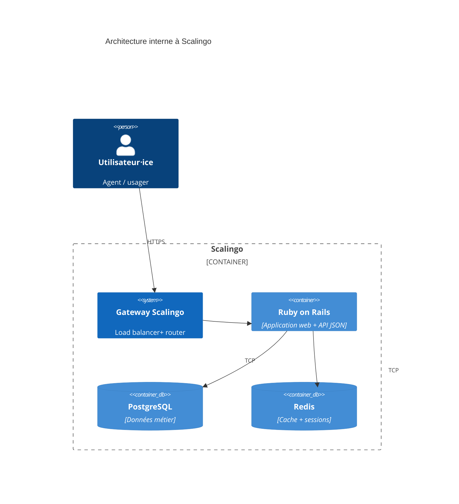
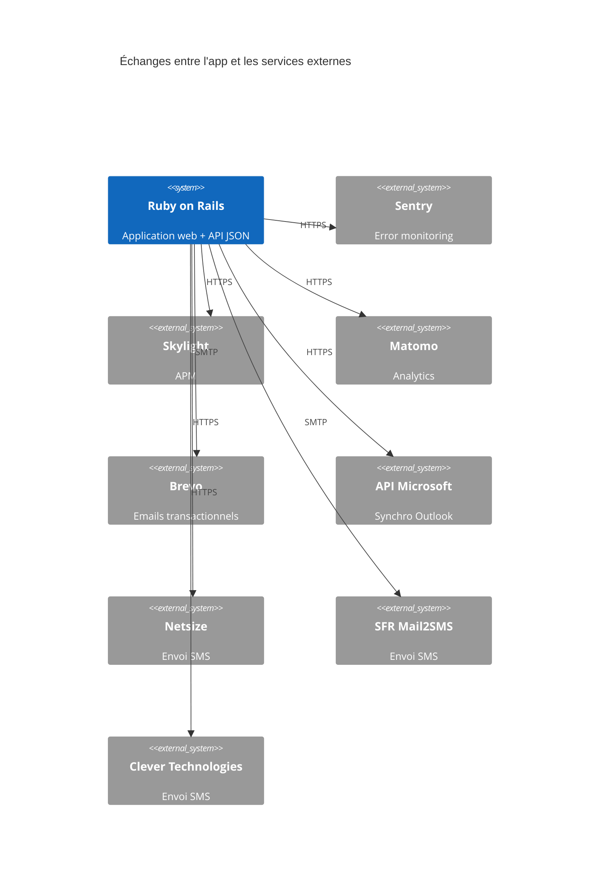
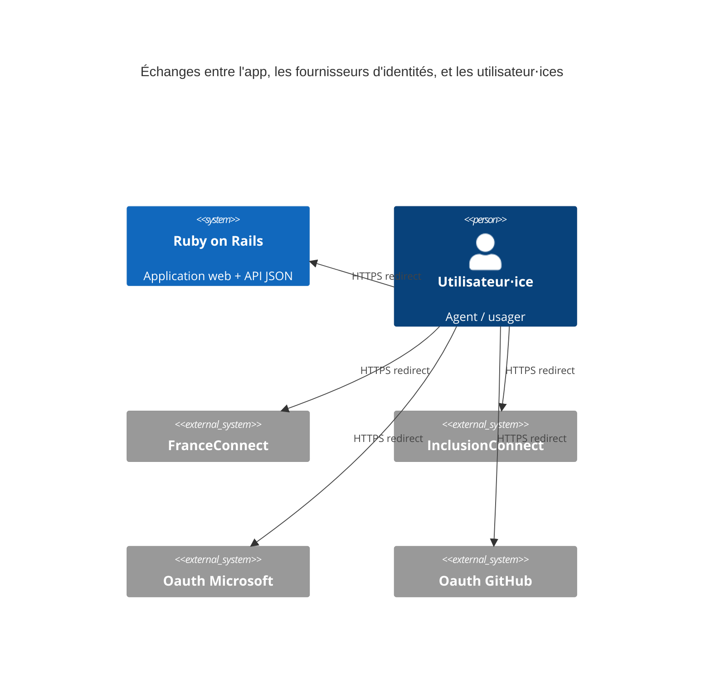

# Dossier technique

> Ce dossier a pour but de présenter l’architecture technique du SI. Il n’est par conséquent ni un dossier d’installation, ni un dossier d’exploitation ou un dossier de spécifications fonctionnelles.

**Nom du projet :** RDV Services Publics

**Dépôt de code :** https://github.com/betagouv/rdv-solidarites.fr

**Hébergeur :** Scalingo, Paris (région Scalingo "osc-secnum-fr1", région Outscale "cloudgouv-eu-west-1")

**Décision d’homologation :** !!<date>!!

**France Relance :** ❌

**Inclusion numérique :** ✅

## Suivi du document

> Le suivi de ce document est assure par le versionnage Git.

## Fiche de contrôle

> Cette fiche a pour vocation de lister l’ensemble des acteurs du projet ainsi que leur rôle dans la rédaction de ce dossier.

| Organisme                  | Nom                   | Rôle                   | Activité  |
|----------------------------|-----------------------|------------------------|-----------|
| RDV Services Publics       | François Ferrandis    | Lead tech              | Rédaction |
| RDV Services Publics       | Victor Mours          | Lead tech              | Relecture |
| RDV Services Publics       | Mehdi Karouch Idrissi | Product Manager        | Relecture |
| ANCT                       | Amélie Naquet         | Cheffe de projet SoNum | Relecture |
| Incubateur des territoires | Charles Capelli       | Consultant SSI         | Relecture |

## Description du projet

Outil de prise de RDV pour le service public. Il permet aux agents de gérer leur planning de RDV, leurs disponibilités et leurs absences, et offre un système de notification envoyées aux usagers pour éviter les lapins.

Il est open source bien qu'il n'y ait qu'une instance, gérée par l'équipe.

Plus d'infos sur la fiche beta : https://beta.gouv.fr/startups/rdv-services-publics.html

## Architecture

### Stack technique

Le projet est un monolithe Ruby on Rails avec une base Postgres pour les données métier et un Redis pour le cache et les
sessions. L'infrastructure est entièrement gérée par Scalingo en PaaS.

Le projet ne contient que très peu de Javascript (petites touches de vanilla JS, pas de framework front) et le HTML est
généré côté serveur. C'est Bootstrap qui est utilisé coté CSS / composants.

Ces choix reflètent un désir de simplicité avant tout, afin de se concentrer sur la valeur métier.

### Matrice des flux

#### Application principale

| Source     | Destination       | Protocole | Port | Localisation      | Interne/URL Externe |
|------------|-------------------|-----------|------|-------------------|---------------------|
| Navigateur | App Rails         | HTTPS     | 443  | Paris/SecNumCloud | Externe             |
| App Rails  | Postgres Scalingo | TCP       | 5432 | Paris/SecNumCloud | Interne             |
| App Rails  | Redis Scalingo    | TCP       | 6379 | Paris/SecNumCloud | Interne             |

#### Tooling

| Source     | Destination | Protocole | Port | Localisation           | Interne/URL Externe   |
|------------|-------------|-----------|------|------------------------|-----------------------|
| App Rails  | Sentry      | HTTPS     | 443  | Tours, France          | sentry.incubateur.net |
| App Rails  | Skylight    | HTTPS     | 443  | Ashburn, Virginia, USA | skylight.io           |
| Navigateur | Matomo      | HTTPS     | 443  | France                 | stats.data.gouv.fr    |

#### Services externes

| Source    | Destination         | Protocole | Port | Localisation  | Interne/URL Externe                 |
|-----------|---------------------|-----------|------|---------------|-------------------------------------|
| App Rails | Brevo               | SMTP      | 587  | Paris, France | smtp-relay.sendinblue.com           |
| App Rails | API Microsoft       | HTTPS     | 587  | Paris, France | graph.microsoft.com                 |
| App Rails | Netsize             | HTTPS     | 587  | France        | europe.ipx.com                      |
| App Rails | SFR mail2SMS        | SMTP      | 587  | France        | @mailtosms.dmc.sfr-sh.fr            |
| App Rails | Clever Technologies | HTTPS     | 587  | France        | webservicesmultimedias.clever-is.fr |

#### Fournisseurs d'identité

| Source     | Destination      | Protocole     | Port | Localisation        | Interne/URL Externe            |
|------------|------------------|---------------|------|---------------------|--------------------------------|
| Navigateur | FranceConnect    | HTTPS (OAuth) | 587  | Paris, France       | smtp-relay.sendinblue.com      |
| Navigateur | InclusionConnect | HTTPS (OAuth) | 587  | France              | connect.inclusion.beta.gouv.fr |
| Navigateur | API Microsoft    | HTTPS (OAuth) | 587  | Amsterdam, Pays-Bas | login.microsoftonline.com      |
| Navigateur | GitHub           | HTTPS (OAuth) | 587  | USA                 | github.com                     |

### Inventaire des dépendances

| Nom de l’applicatif | Service          | Version  | Commentaires                                                    |
|---------------------|------------------|----------|-----------------------------------------------------------------|
| Serveur web         | Rails @ Scalingo | Rails 7  | Voir ci-dessous pour le détail des librairies                   |
| BDD métier          | PostgreSQL       | `13.7.0` | Stockage des données métier, voir [db/schema.rb](/db/schema.rb) |
| BDD technique       | Redis            | `7.0.10` | Stockage des sessions et du cache                               |

La liste des librairies Ruby est disponible dans : 
- [Gemfile](/Gemfile) pour la liste des dépendances directes et la description de la fonctionnalité de chacune des gem
- [Gemfile.lock](/Gemfile.lock) pour la liste complète des gems utilisées directement et indirectement (dépendances
  indirectes), et leurs versions précises

La liste des librairies JS utilisée est disponible dans :

- [package.json](/package.json) pour la liste des dépendances directes
- [package.json](/yarn.lock) pour la liste complète des librairies JS utilisées directement et indirectement (
  dépendances indirectes), et leurs versions précises

### Schéma de l’architecture

!!<Ajouter un graphe sur l’architecture du SI et de ses relations avec les services externes, vous pouvez utiliser notre
instance Kroki pour cela:!! [!!https://kroki.incubateur.anct.gouv.fr/!!](https://kroki.incubateur.anct.gouv.fr/)!!. Les
formats DITAA, BlockDiag ou UML conviennent pour cet exercice>!!

### Schéma des données

Lancer `make generate_db_diagram` pour obtenir un SVG de l'état actuel des tables Postgres.

Nous avons cessé de versionner ce SVG depuis le commit 6b3069c. La dernière version commitée était celle-ci :
https://github.com/betagouv/rdv-solidarites.fr/blob/f12411c0760be1316aae571bb35c62a78a5b7d7f/docs/domain_model.svg

## Exigences générales

### Accès aux serveurs et sécurité des échanges

Les serveurs (applicatif et base de données) sont gérés par Scalingo. Scalingo ne fournit pas de système de rôle : soit
on a accès à un app, soit on ne l'a pas.

Nous avons actuellement 2 apps Scalingo :

- `osc-secnum-fr1/production-rdv-solidarites`
- `osc-secnum-fr1/demo-rdv-solidarites`

Le fait d'avoir accès à une app Scalingo donne les droits suivants :

- augmenter au réduire ne nombre d'instances applicatives de l'app / régler les paramètres d'autoscaling
- administrer la base Postgres (changer la taille de l'instance, mettre à jour Postgres, télécharger des backups, etc)
- administrer la base Redis (même fonctionnalités que pour Postgres ci-dessus)
- visualiser les déploiements passés ou en cours
- configurer le déploiement automatique d'une branche GitHub
- visualiser l'activité de l'app (scaling, déploiements, commandes lancées en one-off)
- visualiser les logs (app + jobs + routeur Scalingo) et en télécharger des archives
- visualiser des metrics (requêtes par minute, temps de réponse, CPU, RAM)
- lire et modifier les variables d'environnements :
  - credentials SMTP du compte secretariat@rdv-solidarites.fr
  - credentials Microsoft Azure
  - credentials de Postgres
  - credentials de Netsize (envoi de SMS)
  - credentials FranceConnect
  - credentials InclusionConnect
  - credentials GitHub
  - master key Rails (permettant de déchiffrer les colonnes chiffrées en base)
  - credentials Brevo (ex Sendinblue)
- octroyer aux équipes support Scalingo le droit d'accéder à l'environnement d'exécution de l'application et aux
  métadonnées et aux données de surveillance des bases de données
- ajouter ou supprimer des collaborateurs sur l'app
- ajouter au supprimer les domaines autorisés à pointer vers l'app
- gérer les alertes

Les accès Scalingo sont octroyés uniquement à l'équipe technique ("devs") car iels en ont besoin de tout ou une partie
des fonctionnalités listées afin de :

- surveiller la santé de l'app de production
- lancer une console distante en production afin d'investiguer des bugs
- ajouter ou mettre à jour des variables d'environnement
- vérifier le bon déploiement des nouvelles versions du code

**Scalingo propose du 2FA par TOTP, mais aucun mécanisme ne force les collaborateurs à l'activer. Nous avons donc dans
notre checklist d'obnboarding un point précisant qu'il faut impérativement activer le 2FA.** En cas de perte des codes
TOTP, Scalingo propose une procédure qui inclut la vérification de l'identité de l'utilisateur concerné par la
transmission d'un document d'identité.

Note : la fonctionnalité de review app est activée sur l'app de démo. Le fichier `scalingo.json` contient la liste des
variables d'environnement qu'il ne faut pas hériter de l'app de démo lors de la création d'une review app. Une review
app est automatiquement créée lors de l'ouverture d'une Pull Request Github, et automatiquement détruire lors de la
fermeture / merge d'une PR.

### Authentification, contrôle d’accès, habilitations et profils

!!<Détailler en quelques lignes le processus d’authentification et la façon dont les accès sont restreints>!!

TODO : Expliquer les logins au sein de l'application : login+password, Franceconnect, *
TODO : Synthèse de comment on définit les rôles (policies), synthèse des typologies d'admins

### Traçabilité des erreurs et des actions utilisateurs

Les logs sont écrits dans le système de log de Scalingo.

Les logs applicatifs (générés par Rails) contiennent, pour chaque requêtes HTTP :

- timestamp
- path HTTP
- méthode HTTP
- format (HTML, JSON)
- controller + action
- durée

Les logs produits par le routeur de Scalingo contiennent, pour chaque requêtes HTTP :

- timestamp
- path HTTP
- méthode HTTP
- IP d'origine
- referer
- user agent

TODO : Mentionner Papertrail, dire qu'on a pas de système pour dire qui a eu accès à quoi
TODO : Quel type de veille des logs ? On y va que pour investiguer ?
TODO : Parler système alertes Sentry + alertes Scalingo (WIP) vers Mattermost

### Politique de mise à jour des applicatifs

Voici les cas dans lesquels nous mettons à jour à jour une librairie spécifique :

- une version plus récente corrige une faille de sécurité (nous utilisons Dependabot pour être prévenu⋅es)
- une version plus récente permet de répondre à un besoin technique ou fonctionnel
- une montée de version est requises par une librairie correspondant aux critères ci-dessus (autrement dit, nous devons
  mettre à jour de manière indirecte)
- une fois par mois, nous mettons à jour les gems vers leur dernier "patch level", afin d'être proactif sur les fixes de
  sécurité et de bug

La décision a été prise le 24 avril 2023, voir log de décision
ici : [2023-04-24-politique-maj-gems.md](/docs/decisions/2023-04-24-politique-maj-gems.md)

TODO : Mentionner dependabot (notifs email activées manuellement par les devs mais je leur ai dit de le faire)

### Intégrité

!!<Quels contrôles avez vous mis en place pour détecter des problèmes d’intégrité du SI et qu’avez vous mis en place
pour vous en prémunir (monitoring, backups, etc)>!!

TODO : Parler de Sentry + backups Scalingo Postgres et Redis + et dire qu'on les teste en local

### Confidentialité

!!<Avez-vous un besoin accru en confidentialité et si oui, qu’avez vous mis en place>!!

TODO : Identifier ce qui est critique et ce qui est protégé, et éventuellement voir ce qui pourrait être prioritaire
