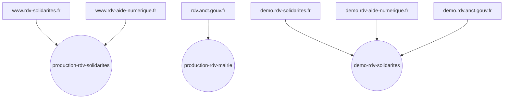
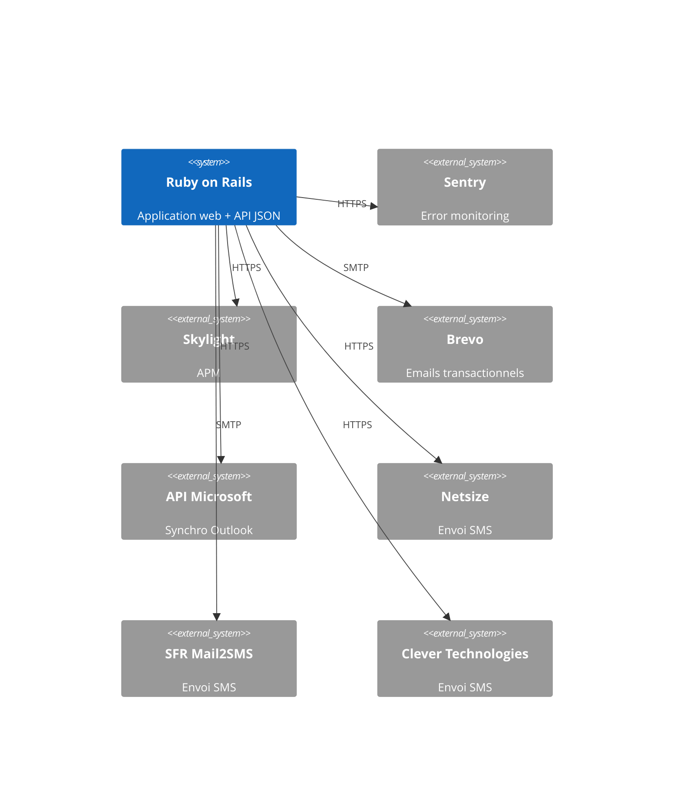
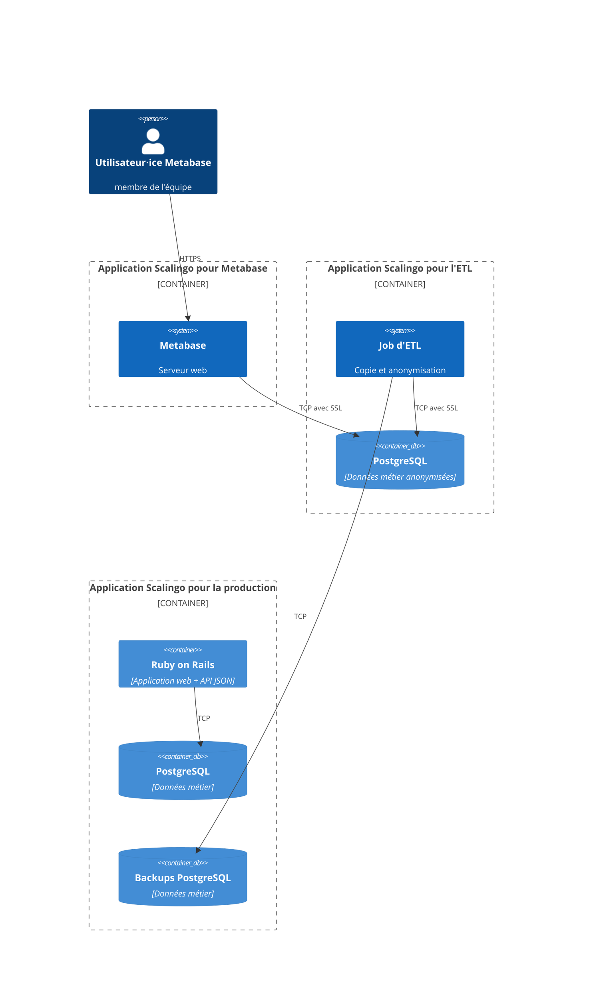

# Dossier technique

> Ce dossier a pour but de présenter l’architecture technique du SI. Il n’est par conséquent ni un dossier d’installation, ni un dossier d’exploitation ou un dossier de spécifications fonctionnelles.

**Nom du projet :** RDV Service Public

**Dépôt de code :** https://github.com/betagouv/rdv-service-public

**Hébergeur :** Scalingo, Paris (région Scalingo "osc-secnum-fr1", région Outscale "cloudgouv-eu-west-1")

**Décision d’homologation :** !!<date>!!

**France Relance :** ❌

**Inclusion numérique :** ✅

## Suivi du document

> Le suivi de ce document est assuré par le versionnage Git.

## Fiche de contrôle

> Cette fiche a pour vocation de lister l’ensemble des acteurs du projet ainsi que leur rôle dans la rédaction de ce dossier.

| Organisme                  | Nom                   | Rôle                   | Activité  |
|----------------------------|-----------------------|------------------------|-----------|
| RDV Service Public         | François Ferrandis    | Lead tech              | Relecture + Rédaction |
| RDV Service Public         | Victor Mours          | Lead tech              | Relecture + Rédaction |
| RDV Service Public         | Mehdi Karouch Idrissi | Product Manager        | Relecture |
| ANCT                       | Amélie Naquet         | Cheffe de projet SoNum | Relecture |
| Incubateur des territoires | Charles Capelli       | Consultant SSI         | Relecture |

## Description du projet

Outil de prise de RDV pour le service public. Il permet aux agents de gérer leur planning de RDV, leurs disponibilités et leurs absences, et offre un système de notifications envoyées aux usagers pour éviter rendez-vous non-honorés.

Il est open source, bien que toutes les instances soient gérées par l'équipe.

Plus d'infos sur la fiche beta : https://beta.gouv.fr/startups/rdv-service-public.html

## Architecture

### Stack technique

Le projet est un monolithe Ruby on Rails avec une base Postgres pour les données métier et un Redis pour le cache et les
sessions. L'infrastructure est entièrement gérée par Scalingo en PaaS.

Le projet ne contient que très peu de Javascript (petites touches de vanilla JS, pas de framework front) et le HTML est
généré côté serveur. Coté CSS / composants, c'est principalement Bootstrap qui est utilisé, avec un usage grandissant du Design System de l'état (DSFR) pour les interfaces usager.

Ces choix reflètent un désir de simplicité avant tout, afin de rester agiles et se concentrer sur la valeur métier.
Ces choix techniques sont aussi influencés par la culture de la communauté Ruby.

### Matrice des flux

#### Applications métier sur Scalingo

| Source           | Destination       | Protocole | Port | Localisation      | Interne/URL Externe |
|------------------|-------------------|-----------|------|-------------------|---------------------|
| Navigateur       | App Rails         | HTTPS     | 443  | Paris/SecNumCloud | Externe             |
| Clients API JSON | App Rails         | HTTPS     | 443  | Paris/SecNumCloud | Externe             |
| Clients Webcal   | App Rails         | HTTPS     | 443  | Paris/SecNumCloud | Externe             |
| App Rails        | Postgres Scalingo | TCP       | 5432 | Paris/SecNumCloud | Interne             |
| App Rails        | Redis Scalingo    | TCP       | 6379 | Paris/SecNumCloud | Interne             |

#### Tooling (error monitoring, APM)

| Source     | Destination | Protocole | Port | Localisation              | Interne/URL Externe                             |
|------------|-------------|-----------|------|---------------------------|-------------------------------------------------|
| App Rails  | Sentry      | HTTPS     | 443  | Tours, France             | sentry.incubateur.net                           |
| Sentry     | N8n         | HTTPS     | 443  |                           | n8n.inclusion-numerique.incubateur.anct.gouv.fr |
| N8n        | Mattermost  | HTTPS     | 443  | Paris/SecNumCloud, France | mattermost.incubateur.net                       |
| App Rails  | Skylight    | HTTPS     | 443  | Ashburn, Virginia,    USA | skylight.io                                     |
| Extension PostgreSQL de l'app Rails | Appli ETL sur Scalingo | | | Paris/SecNumCloud | https://dashboard.scalingo.com/apps/osc-secnum-fr1/rdv-service-public-etl |
| Appli ETL sur Scalingo | Metabase | TCP/IP avec SSL | 30204 | Paris/SecNumCloud | https://rdv-service-public-metabase.osc-secnum-fr1.scalingo.io |

#### Services externes

| Source                            | Destination                | Protocole     | Port | Localisation        | Interne/URL Externe                 |
|-----------------------------------|----------------------------|---------------|------|---------------------|-------------------------------------|
| App Rails                         | Brevo                      | SMTP          | 587  | Paris, France       | smtp-relay.sendinblue.com           |
| App Rails                         | API et Oauth Microsoft     | HTTPS         | 443  | Paris, France       | graph.microsoft.com                 |
| App Rails                         | Netsize                    | HTTPS         | 443  | France              | europe.ipx.com                      |
| App Rails                         | SFR mail2SMS               | SMTP          | 587  | France              | @mailtosms.dmc.sfr-sh.fr            |
| App Rails                         | Clever Technologies        | HTTPS         | 443  | France              | webservicesmultimedias.clever-is.fr |
| Navigateur redirigé par App Rails | API Microsoft              | HTTPS (OAuth) | 443  | Amsterdam, Pays-Bas | login.microsoftonline.com      |

Note : l'application permet aussi de définir des webhooks sortants, et donc d'appeler en HTTPS un service externe
lors de la création, modification ou suppression de certaines données applicatives. On sait que la Drôme et les départements qui
utilisent RDV Insertion utilisent ces webhooks.

#### Fournisseurs d'identité

| Source     | Destination      | Protocole     | Port | Localisation        | Interne/URL Externe            |
|------------|------------------|---------------|------|---------------------|--------------------------------|
| Navigateur | FranceConnect    | HTTPS (OAuth) | 443  | Paris, France       | smtp-relay.sendinblue.com      |
| Navigateur | InclusionConnect | HTTPS (OAuth) | 443  | France              | connect.inclusion.beta.gouv.fr |
| Navigateur | GitHub           | HTTPS (OAuth) | 443  | USA                 | github.com                     |

### Inventaire des dépendances

| Nom de l’applicatif | Service          | Version   | Commentaires                                                    |
|---------------------|------------------|-----------|-----------------------------------------------------------------|
| Serveur web         | Rails @ Scalingo | Rails 7   | Voir ci-dessous pour le détail des librairies                   |
| BDD métier          | PostgreSQL       | `14.10.0` | Stockage des données métier, voir [db/schema.rb](/db/schema.rb) |
| BDD technique       | Redis            | `7.2.3`   | Stockage des sessions et du cache                               |

La liste des librairies Ruby est disponible dans :
- [Gemfile](/Gemfile) pour la liste des dépendances directes et la description de la fonctionnalité de chacune des gems
- [Gemfile.lock](/Gemfile.lock) pour la liste complète des gems utilisées directement et indirectement (dépendances
  indirectes), et leurs versions précises

La liste des librairies JS utilisée est disponible dans :

- [package.json](/package.json) pour la liste des dépendances directes
- [package.json](/yarn.lock) pour la liste complète des librairies JS utilisées directement et indirectement (
  dépendances indirectes), et leurs versions précises

### Schéma de l’architecture

Notre application est accessible sous 3 "marques" différentes :
- https://www.rdv-solidarites.fr/
- https://www.rdv-aide-numerique.fr/
- https://rdv.anct.gouv.fr/

Nous avons actuellement 3 instances :
- `production-rdv-solidarites` : serveur de production pour `www.rdv-solidarites.fr` et `www.rdv-aide-numerique.fr`
- `production-rdv-mairie` : serveur de production pour `rdv.anct.gouv.fr`
- `demo-rdv-solidarites` : serveur de démo pour `demo.rdv-solidarites.fr`, `demo.rdv-aide-numerique.fr` et `demo.anct.gouv.fr`

`production-rdv-solidarites` est notre instance de production actuelle. Elle est représentée fidèlement dans les
schémas ci-dessous. `production-rdv-mairie` est une instance plus récente créée en mai 2023. Nous avons
créé cette instance afin de séparer les données de plateforme `rdv.anct.gouv.fr` de nos données existantes.

L'instance `demo-rdv-solidarites` sert de plateforme de démo pour nos 3 domaines.

Chaque schémas ci-dessous représente une seule instance (une seule app Scalingo), qu'elle soit de prod ou de démo.
À noter que les instances `demo-rdv-solidarites` et `production-rdv-mairie` n'utilisent que `netsize` comme
fournisseur de SMS, les autres fournisseurs étant spécifiques à des départements du médico-social.

#### Architecture interne à Scalingo

#### Échanges entre l'app et les services externes

#### Échanges entre l'app, les fournisseurs d'identités, et les utilisateur⋅ices

#### Échanges entre l'app et Metabase

Notre équipe utilise Metabase pour comprendre l'utilisation de l'application par les différents. Metabase pointe vers une copie anonymisée de la base de production.
Cette copie anonymisée est gérée par une application Scalingo d'ETL (Extract Transform Load). Cette appli n'a pas de serveur web, mais juste un job qui est lancé périodiquement. Ce job télécharge un backup de la base de données de production, exécute un script d'anonymisation pour supprimer les données personnelles ou sensibles.
Le serveur web Metabase est hébergé sur une application Scalingo.

### Gestion DNS

C'est **Gandi (gandi.net)** qui fournit nos noms de domaine et la gestion DNS.

Nous y gérons les domaines suivants :
- `rdv-solidarites.fr` : domaine de production historique, également utilisé pour `demo.rdv-solidarites.fr`
- `rdv-service-public.fr` : gestion d'une boite mail support@rdv-service-public.fr
- `rdv-aide-numerique.fr` : domaine de production de la plateforme RDV Aide Numérique (pointe sur l'instance principale)
- `rdv-services-publics.fr` : anti phishing : redirige vers `rdv-service-public.fr`
- `rdv-solidarite.fr` : anti phishing : redirige vers `rdv-solidarites.fr`
- `rdv-solidarités.fr` : anti phishing : redirige vers `rdv-solidarites.fr`
- `rdv-solidarité.fr` : anti phishing : redirige vers `rdv-solidarites.fr`

### Schéma des données

Lancer `make generate_db_diagram` pour obtenir un SVG de l'état actuel des tables Postgres. Le fichier `db/schema.rb` donne aussi une description des tables via un DSL Ruby.

Nous avons cessé de versionner ce SVG depuis le commit 6b3069c. La dernière version commitée était celle-ci :
https://github.com/betagouv/rdv-solidarites.fr/blob/f12411c0760be1316aae571bb35c62a78a5b7d7f/docs/domain_model.svg

## Exigences générales

### Accès aux serveurs et sécurité des échanges

Les serveurs (applicatif et base de données) sont gérés par Scalingo. Scalingo ne fournit pas de système de rôle : soit
on a accès à une app, soit on ne l'a pas.

Nous avons actuellement 6 apps Scalingo, les trois premières pour le métier, les trois autres pour le tooling :

- `osc-secnum-fr1/production-rdv-solidarites`
- `osc-secnum-fr1/production-rdv-mairie`
- `osc-secnum-fr1/demo-rdv-solidarites`
- `osc-secnum-fr1/rdv-service-public-etl`
- `osc-secnum-fr1/rdv-service-public-etl-staging`
- `osc-secnum-fr1/rdv-service-public-metabase`

Le fait d'avoir accès à une app Scalingo donne les droits suivants :

- augmenter ou réduire le nombre d'instances applicatives de l'app / régler les paramètres d'autoscaling
- administrer la base Postgres (changer la taille de l'instance, mettre à jour Postgres, télécharger des backups, etc)
- administrer la base Redis (même fonctionnalités que pour Postgres ci-dessus)
- visualiser les déploiements passés ou en cours
- configurer le déploiement automatique d'une branche GitHub
- visualiser l'activité de l'app (scaling, déploiements, commandes lancées en one-off)
- visualiser les logs (app + jobs + routeur Scalingo) et en télécharger des archives
- visualiser des metrics (requêtes par minute, temps de réponse, CPU, RAM)
- lire et modifier les variables d'environnements :
  - credentials SMTP du compte secretariat@rdv-solidarites.fr
  - credentials Microsoft Azure
  - credentials de Postgres
  - credentials de Netsize (envoi de SMS)
  - credentials FranceConnect
  - credentials InclusionConnect
  - credentials GitHub
  - master key Rails (permettant de déchiffrer les colonnes chiffrées en base)
  - credentials Brevo (ex Sendinblue)
- octroyer aux équipes support Scalingo le droit d'accéder à l'environnement d'exécution de l'application et aux
  métadonnées et aux données de surveillance des bases de données
- ajouter ou supprimer des collaborateurs sur l'app
- ajouter au supprimer les domaines autorisés à pointer vers l'app
- gérer les alertes

Les accès Scalingo sont octroyés uniquement à l'équipe technique ("devs") car iels en ont besoin de tout ou une partie
des fonctionnalités listées afin de :

- surveiller la santé de l'app de production
- lancer une console distante en production afin d'investiguer des bugs
- ajouter ou mettre à jour des variables d'environnement
- vérifier le bon déploiement des nouvelles versions du code

**Scalingo propose du 2FA par TOTP, mais aucun mécanisme ne force les collaborateurs à l'activer. Nous avons donc dans
notre checklist d'onboarding un point précisant qu'il faut impérativement activer le 2FA.** En cas de perte des codes
TOTP, Scalingo propose une procédure qui inclut la vérification de l'identité de l'utilisateur concerné par la
transmission d'un document d'identité.

Note : les review apps sont créées manuellement et héritent de l'app de démo. Le fichier `scalingo.json` contient la liste des variables d'environnement qu'il ne faut pas hériter de l'app de démo lors de la création d'une review app. Les review apps sont automatiquement détruites lors de la fermeture d'une PR.

#### Détection de fuite de secrets

Nous avons activé la fonctionnalité "Secret scanning" de GitHub sur notre dépôt. Ce système envoie des alertes et bloque le push si des secrets sont détectés dans un commit.

GitGuardian, qui fait de la détection automatisée de fuites de secrets est aussi activé parmis les Github actions de la CI.

### Authentification, contrôle d’accès, habilitations et profils

L'application a 3 types d'utilisateurs :
- usager⋅e
- agent⋅e
- super admin
Pour visualiser, modifier ou annuler un RDV, l'usager peut soit cliquer sur un lien fourni en notification mail ou SMS et entrer les trois premières lettres de son nom de famille.

Les comptes utilisateurs ont une contrainte d'unicité sur les emails mais ce n'est pas le cas des profils sans emails créés par les agents.

Les sessions sont déconnectées automatiquement.

#### Les usager⋅es

Les usager⋅es prennent RDV avec les agents. Iels peuvent voir leurs RDVs, annuler ou modifier des RDVs futurs, et
changer son e-mail, mot de passe et infos personnelles.

Pour visualiser, modifier ou annuler un RDV, l'usager peut soit cliquer sur un lien fourni en notification mail ou SMS,
soit se connecter pour accéder à tous ses RDVs.

La connexion à un profil usager est faite par email + mot de passe. Les mots de passes sont stockés salés et chiffrés
(en utilisant Devise qui utilise Bcrypt). Une connexion via FranceConnect est aussi proposée : un compte est alors
créé ou relié si l'e-mail existe déjà dans notre base usagers.

Un mot de passe doit avoir une longueur d'**au moins 12 caractères** et ne pas faire partie des 20 000 mots de passe les plus utilisés par des francophones (https://github.com/francois-ferrandis/common_french_passwords).

#### Les agents

Les agents ont accès à diverses fonctionnalités touchants à :
- la déclaration de leurs plages d'ouvertures et absences
- le configuration des motifs de RDVs et des lieux de RDVs
- la gestion des autres agents de leur organisation
- la liste de leurs RDVs et de ceux de leurs collègues
- la sectorisation géographique des lieux
- la définition de webhooks (sortants) pour l'interopérabilité de la solution

Les règles d'accès à ces ressources sont complexes et dépendent de plusieurs niveaux d'accès attribués aux agents.
Ces niveaux d'accès sont gérés par les administrateurs locaux de la solution au sein des organisations
utilisatrices (départements, mairies).

La connexion à un profil agent est faite par email + mot de passe. Les mots de passes sont stockés salés et chiffrés
(en utilisant une Devise qui utilise Bcrypt). Une connexion via InclusionConnect est aussi proposée : un compte est alors
créé ou relié si l'e-mail existe déjà dans notre base agents.

Un mot de passe doit avoir une longueur d'**au moins 12 caractères** et ne pas faire partie des 20 000 mots de passe les plus utilisés par des francophones (https://github.com/francois-ferrandis/common_french_passwords).

#### Les super admins

Une interface CRUD permettant de gérer l'ensemble des organisations, services, motifs, lieux, territoires et
usagers est proposée en interne à l'équipe.

Afin de s'y connecter, il faut utiliser l'OAuth de GitHub. L'adresse e-mail alors fournie par GitHub doit être
présente dans une table `super_admins`, où les entrées sont crées et supprimées à la main lors de l'arrivée et
du départ de membres de l'équipe;

Tous les membres de l'équipe faisant partie de [l'organisation `betagouv` sur Github](https://github.com/betagouv), ils utilisent une authentification à 2 facteurs.

### Traçabilité des erreurs et des actions utilisateurs

#### Logs textuels

Les logs textuels sont écrits dans le système de log de Scalingo. Cela comprend :
- Les logs des commandes de la production (e.g. lancer la console)
- les changements de variables d'environnements

Les logs applicatifs (générés par Rails) contiennent, pour chaque requêtes HTTP :

- timestamp
- path HTTP
- méthode HTTP
- format (HTML, JSON)
- controller + action
- durée

Les logs produits par le routeur de Scalingo contiennent, pour chaque requêtes HTTP :

- timestamp
- path HTTP
- méthode HTTP
- IP d'origine
- referer
- user agent

La consultation des logs textuels ne se fait que lors d'investigations de bugs. Leur usage est donc uniquement ponctuel
et leur consultation est manuelle. Nous n'avons pas de système d'analyse de logs.

#### Traçabilité applicative / auditing

Nous utilisons également la gem `paper_trail`, qui permet d'enregistrer chaque modification (création, modification,
suppression) effectuée dans une sélection de tables Postgres. Elle est activée sur une partie des tables et colonnes
et permet ainsi d'avoir une traçabilité partielle des changements.

Nous n'avons en revanche pas de système permettant de savoir quel profil a eu accès à quelle information et quand.

#### Monitoring d'erreur

Nous utilisons Sentry afin d'être informé⋅es sur les nouvelles erreurs, et le volume des erreurs existantes.
Nous sommes alerté⋅es en cas de nouvelles erreurs ou volume inhabituel, en direct sur notre outil de
communication principal Mattermost. Nous utilisons l'instance Sentry de l'incubateur beta.gouv (sentry.incubateur.net).

Notre hébergeur Scalingo propose aussi un système d'alerting déclenché selon des métriques diverses, mais
celui-ci n'est pas utilisé actuellement car sa calibration est difficile.

### Politique de mise à jour des applicatifs

Voici les cas dans lesquels nous mettons à jour une librairie spécifique :

- une version plus récente corrige une faille de sécurité (nous utilisons Dependabot pour être prévenu⋅es)
- une version plus récente permet de répondre à un besoin technique ou fonctionnel
- une montée de version est requises par une librairie correspondant aux critères ci-dessus (autrement dit, nous devons
  mettre à jour de manière indirecte)
- une fois par mois, nous mettons à jour les gems vers leur dernier "patch level", afin d'être proactif sur les fixes de
  sécurité et de bugs

La décision a été prise le 24 avril 2023, voir log de décision
ici : [2023-04-24-politique-maj-gems.md](/docs/decisions/2023-04-24-politique-maj-gems.md)

Afin d'être prévenus lors de la publication d'une CVE, nous utilisons Dependabot sur notre dépôt GitHub.
Une alerte e-mail est envoyée aux devs qui watchent le dépôt (et nous faisons en sorte de le watch à travers
notre procédure d'onboarding).

### Détection des vulnérabilités

Nous utilisons la librairie ruby `brakeman` qui scanne le code afin de trouver des mauvaises pratiques de sécurité.

Nous avons également activé CodeQL sur notre dépot GitHub. Cet outil permet de détecter les vulnérabilités via une analyse statique du code.

### Intégrité

Des backups de nos bases de données Postgres et Redis sont faîtes automatiquement par Scalingo. Ces backups sont
créés quotidiennement et gardés 1 an.

Nous les testons régulièrement en les téléchargeant et en les chargeant dans notre environnement local.

Scalingo nous offre également la fonctionnalité de Point-in-time Recovery. Nous profitons également d'un système
de cluster avec 2 nodes, qui permet un failover automatique en cas de plantage d'une instance Postgres.

### Confidentialité

**L'application est initialement conçue pour la prise de RDV dans le milieu médico-social. Nous manipulons donc des données médicales.**

Parmi les données que nous manipulons, les plus critiques sont :
- les coordonnées des usager⋅es
- l'historique des RDVs pris par une personne ainsi que le motif de ces RDV
- le champs "contexte", un champs texte libre où les agents peuvent saisir des informations de contexte sur un RDV

### Flux des données personnelles dans le SI

Le flux des données personnelles dans le SI est détaillé dans  [ce diagramme](/docs/flux_de_donnees_personnelles_si.svg) et [sa légende](/docs/legende_flux_de_donnees_personnelles_si.md).

### Bonnes pratiques de sécurité au sein de l'équipe

Lors de l'accueil d'un nouveau membre de l'équipe, on le forme à plusieurs bonnes pratiques de sécurité :
- chiffrer son disque dur
- Prendre l’habitude de verrouiller son écran dès qu’on est dans un lieu public (coworking, bureaux à Ourq, etc). Sous Mac OSX, nous recommandons l’usage des coins actifs.

Pour les membres de l'équipe technique, on prend ces mesures supplémentaires :
- [formation aux bonnes pratiques d'accès aux dumps de la production](docs/4-notes-techniques.md#Dumps-de-production)
- activation de l'authentification à 2 facteur sur Scalingo

#### Suppression automatique de données anciennes

Voici les suppressions automatiques mises en place :
- Suppression des RDVs de plus de 2 ans
- Suppression des plages d'ouverture de plus de 1 an
- Suppression des logs PaperTrail (auditing) de plus de 1 an contenant des données personnelles autres que l'identité de la personne dont on journalise l'action.
- Anonymisation des logs PaperTrail(auditing) de plus de 1 an ne contenant pas données personnelles autre que l'identité de la personne dont on journalise l'action
- Suppression des logs PaperTrail (auditing) de plus de 5 ans
- Suppression des usagers inactifs pendant au moins 2 ans (pas de rdv dans les 2 dernières années, et compte créé depuis plus de 2 ans)
- Suppression des agents inactifs pendant au moins 2 ans (pas de rdv dans les 2 dernières années, et compte créé depuis plus de 2 ans, pas de connexion depuis 2 ans)
