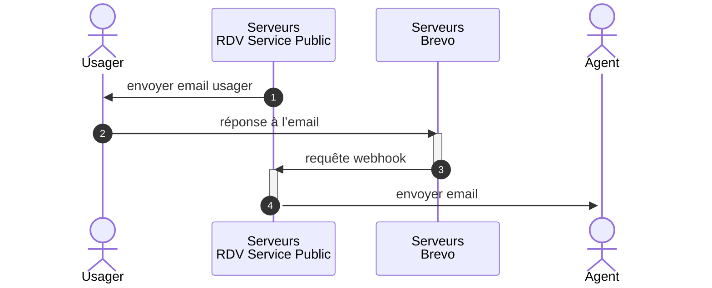

# Interconnexion Brevo - Réception d’emails

Nous utilisons Brevo pour nos emails transactionnels et pour la réception des réponses aux emails des usagers et des agents.

Cette fonctionnalité de réception d’email s’appelle « Inbound parsing webhooks » chez Brevo, il y a de la documentation ici https://developers.brevo.com/docs/inbound-parse-webhooks.

## Fonctionnement haut-niveau

Nous souhaitons permettre aux usagers de répondre aux emails transactionnels.

Nous souhaitons que ces réponses aillent directement aux agents concernés plutôt qu’à notre support.
Cela nous permet de réduire la quantité de tickets de support sans plus-value et d’éviter de recevoir des informations sensibles.

Nous ne souhaitons en revanche pas exposer directement l’email de l’agent aux usagers pour ne pas révéler leur identité.

La solution mise en place permet aux usagers de répondre aux emails transactionnels concernant des RDV.
Leur réponse est automatiquement transmise aux agents par un autre mail.
Les agents ne peuvent pas répondre directement à ce mail de transfert.
Ils doivent passer par RDV Service Public pour récupérer les informations sur le RDV et l’usager et éventuellement y répondre.

## Détails techniques

Les emails envoyés aux usagers concernant des RDV contiennent un header `REPLY-TO` avec une adresse comme `rdv+abcd-efgh@reply.rdv-solidarites.fr` :
- `abcd-efgh` est l’UUID du RDV. Il permet d’identifier les agents à prévenir.
- `reply.rdv-solidarites.fr` est un domaine configuré pour diriger les réponses mails vers les serveurs de Brevo

Lorsque Brevo reçoit un mail, il le parse et nous envoie un webhook.
Le contrôleur reçevant les webhooks de Brevo est `app/controllers/inbound_emails_controller.rb`

