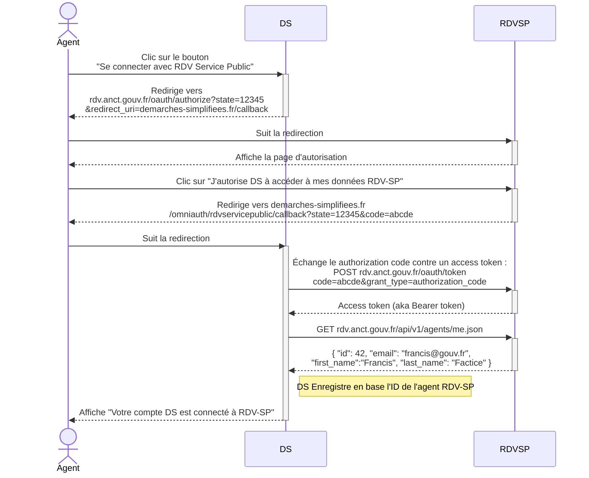

# RDV-SP comme provider OAuth

## Description

Cette application peut s'interconnecter avec des clients externes via le protocole Oauth 2.0. Ce mécanisme permet à une application tierce de proposer à ses utilisateurs de l’autoriser à faire des appels à l'API RDV Service Public en son nom. Par exemple, un agent qui a un compte sur demarches-simplifiees.fr peut autoriser la plateforme à créer des RDV en son nom sur RDV Service Public.

Ci-dessous le processus d'autorisation par lequel un agent de demarches-simplifiees.fr lie son compte à RDV-SP :

## Développement

Une application Sinatra de dev simule le comportement d’un client distant comme Mon Suivi Social : `scripts/mon_suivi_social_local.rb`.
Elle est lancée par défaut dans le `Procfile.dev` et accessible sur : `http://localhost:3010`.

Elle permet de faire un parcours de prise de RDV via les RDV plans.
